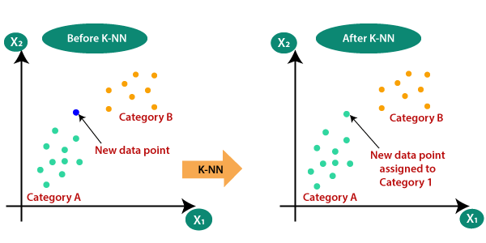
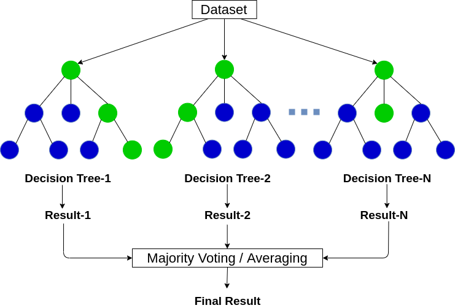

<!-- DON'T EDIT THIS SECTION, INSTEAD RE-RUN doctoc TO UPDATE -->
**Table of Contents**  *generated with [DocToc](https://github.com/thlorenz/doctoc)*

- [Basic Machine Learning Algorithms](#basic-machine-learning-algorithms)
  - [Supervised learning algorithms](#supervised-learning-algorithms)
    - [Naive Bayes classifier](#naive-bayes-classifier)
    - [Random forest](#random-forest)
    - [Support vector machine](#support-vector-machine)
  - [Unsupervised learning algorithms](#unsupervised-learning-algorithms)
    - [k-nearest neighbors algorithm](#k-nearest-neighbors-algorithm)
    - [Principal component analysis](#principal-component-analysis)
  - [Classification model evaluation](#classification-model-evaluation)
  - [Neural network](#neural-network)

<!-- END doctoc generated TOC please keep comment here to allow auto update -->

# Basic Machine Learning Algorithms
 

Machine Learning is a branch of artificial intelligence that provides computer systems the ability to automatically learn and improve from experience without being explicitly programmed. It is broadly divided into 2 main categories: Supervised and Unsupervised. 

 

## Supervised learning algorithms 

 
Supervised learning is a machine learning method in which models are trained using labeled data. In supervised learning, models need to find the mapping function to map the input variable (X) with the output variable (Y) : Y=f(x). Supervised learning needs supervision to train the model, which is similar to as a student learns things in the presence of a teacher. Supervised learning can be used for two types of problems: Classification and Regression.

We're going to see some supervised learning algorithms:

 

### Naive Bayes classifier
 
Bayesian algorithms are a family of probabilistic classifiers used in ML based on applying Bayes’ theorem.

Naive Bayes classifier was one of the first algorithms used for machine learning. It is suitable for binary and multiclass classification and allows for making predictions and forecast data based on historical results.

 

### Random forest
 

A random forest is a machine learning technique that’s used to solve regression and classification problems. It utilizes ensemble learning, which is a technique that combines many classifiers to provide solutions to complex problems.

A random forest algorithm consists of many decision trees. The ‘forest’ generated by the random forest algorithm is trained through bagging or bootstrap aggregating. Bagging is an ensemble meta-algorithm that improves the accuracy of machine learning algorithms.

The (random forest) algorithm establishes the outcome based on the predictions of the decision trees. It predicts by taking the average or mean of the output from various trees. Increasing the number of trees increases the precision of the outcome.

 

### Support vector machine
 
Support vector machines are another group of algorithms used for classification and, sometimes, regression tasks. SVM is great because it gives quite accurate results with minimum computation power.

The goal of the SVM is to find a hyperplane in an N-dimensional space (where N corresponds with the number of features) that distinctly classifies the data points. The accuracy of the results directly correlates with the hyperplane that we choose. We should find a plane that has the maximum distance between data points of both classes.

This hyperplane is graphically represented as a line that separates one class from another. Data points that fall on different sides of the hyperplane are attributed to different classes.

 

## Unsupervised learning algorithms
 
Unsupervised learning is another machine learning method in which patterns inferred from the unlabeled input data. The goal of unsupervised learning is to find the structure and patterns from the input data. Unsupervised learning does not need any supervision. Instead, it finds patterns from the data by its own. Unsupervised learning can be used for two types of problems: Clustering and Association.

 

### k-nearest neighbors algorithm
 
This is one of the simplest classification algorithms sometimes used in regression tasks. To train the classifier, we must have a set of data with predefined classes. The marking is done manually involving specialists in the studied area. Using this algorithm, it is possible to work with multiple classes or clear up the situations where inputs belong to more than one class. The method is based on the assumption that similar labels correspond to close objects in the attribute vector space.

 

### Principal component analysis
 

Principal component analysis is an algorithm for feature extraction. it combines the input variables in a specific way, and then it is possible to drop the “least important” variables while still retaining the most valuable parts of all of the variables. One of the possible uses of PCA is when the images in the dataset are too large. A reduced feature representation helps to quickly deal with tasks such as image matching and retrieval.

 

## Classification model evaluation
 
After building a predictive classification model, you need to evaluate the performance of the model, that is how good the model is in predicting the outcome of new observations test data that have been not used to train the model.

In other words you need to estimate the model prediction accuracy and prediction errors using a new test data set. Because we know the actual outcome of observations in the test data set, the performance of the predictive model can be assessed by comparing the predicted outcome values against the known outcome values.

The commonly used metrics and methods for assessing the performance of predictive classification models :

- Average classification accuracy, representing the proportion of correctly classified observations.
- Confusion matrix, which is 2x2 table showing four parameters, including the number of true positives, true negatives, false negatives and false positives.
- Precision, Recall and Specificity, which are three major performance metrics describing a predictive classification model
- ROC curve, which is a graphical summary of the overall performance of the model, showing the proportion of true positives and false positives at all possible values of probability cutoff. The Area Under the Curve (AUC) summarizes the overall performance of the classifier.
 

## Neural network

 
A neural network is a sequence of neurons connected by synapses, which reminds of the structure of the human brain. However, the human brain is even more complex. What is great about neural networks is that they can be used for basically any task from spam filtering to computer vision. However, they are normally applied for machine translation, anomaly detection and risk management, speech recognition and language generation, face recognition, and more.

A neural network consists of neurons, or nodes. Each of these neurons receives data, processes it, and then transfers it to another neuron. Every neuron processes the signals the same way. But how then do we get a different result? The synapses that connect neurons to each other are responsible for this. Each neuron is able to have many synapses that attenuate or amplify the signal. Also, neurons are able to change their characteristics over time. By choosing the correct synapse parameters, we will be able to get the correct results of the input information conversion at the output.

There are many different types of NN:

- Feedforward neural networks (FF or FFNN) and perceptrons § are very straightforward, there are no loops or cycles in the network. In practice, such networks are rarely used, but they are often combined with other types to obtain new ones.

- A Hopfield network (HN) is a fully connected neural network with a symmetric matrix of links. Such a network is often called an associative memory network. Just like a person who seeing one half of the table, can imagine the second half, this network, receiving a noisy table, restores it to full.

- Convolutional neural networks (CNN) and deep convolutional neural networks (DCNN) are very different from other types of networks. They are usually used for image processing, audio or video-related tasks. A typical way to apply CNN is to classify images.
 

